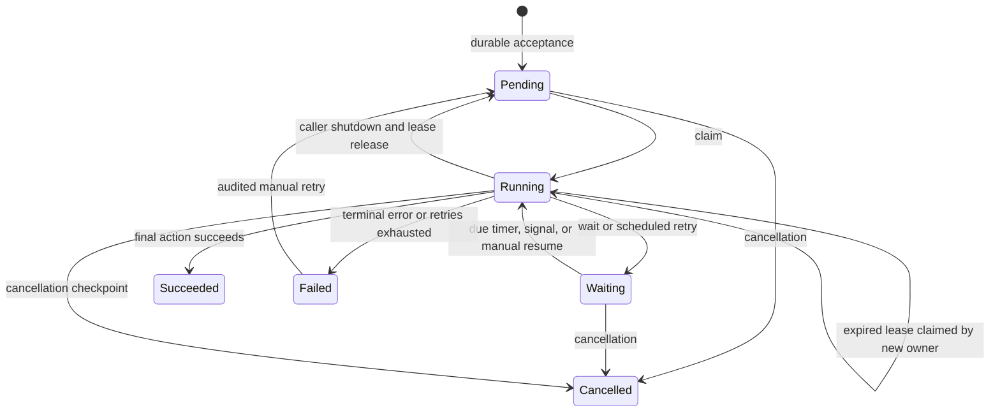

# Architecture and provider contract

## Dependencies

```text
Application -> SqlServer -> EntityFrameworkCore -> Core -> Abstractions
Additional provider -----------------------------> Core + Abstractions
```

Abstractions contains no EF types. Core contains no database references. The SQL Server assembly owns its migrations and database dependencies. `IWorkflowStore` describes guarantees; future providers may implement it without EF.

Definitions are built through typed interface adapters inside a scope. The registry validates duplicate type/name/version registrations before publishing configured definitions. Explicit interface implementations are supported. Host startup validates registered definitions, step resolution, store service resolution, and policy settings. Resolving the store does not verify database connectivity or whether migrations have been applied; deploy migrations and check database readiness separately. Non-hosted start/resume also initialize definitions.

## State machine



An abandoned `Started` history record is marked `Abandoned` when the recovered owner begins another attempt. History is evidence of attempts, not proof that an external system did or did not apply an effect.

## Mandatory IWorkflowStore guarantees

1. `CreateAsync` enforces uniqueness by workflow name/business key, returns the winning instance after races, and does not leave a poisoned session.
2. `GetDueAsync` applies its limit in storage and includes pending work, due timer waits, signaled waits, and expired/missing running leases.
3. `TryClaimAsync` is an atomic conditional mutation. A forced manual claim can bypass waits but cannot steal an unexpired running lease or claim a terminal instance.
4. `RenewLeaseAsync` checks token, running status, and expiry. An expired owner cannot revive its lease. A cancellation request stops renewal.
5. `BeginStepAsync` verifies ownership and allocates the attempt atomically. Interrupted started records are abandoned. An attempt's identity is stable under provider transaction retries.
6. `CommitAsync` verifies ownership and commits history/context/cursor/status together. A concurrent persisted cancellation request cannot be overwritten by the executor's stale snapshot. Repeating an already committed identical attempt acknowledges it without reapplying progress; conflicting repeated outcomes are rejected.
7. `ReleaseAsync` affects only the current unexpired owner. Work returns to pending, or cancelled if cancellation was requested.
8. Administrative retry is conditional on failed status, resets its failure budget, and atomically records the intervention reason.
9. Signals have an immutable unique key `(instance ID, name)` and can precede waits. Queries expose detached state with deterministic pagination ordering.
10. Terminal cleanup is bounded, cascades history/signals, and preserves failures. Deletion forgets business-key uniqueness.

Providers must define comparison/collation semantics consistently for workflow names, keys, and signal names. Applications should use canonical casing. SQL Server uniqueness follows database collation; the in-memory definition registry compares names without case.

## EF implementation

The store opens an independent DbContext per operation. Heartbeats do not share the executor's context. Conditional updates fence ownership; row locks and database transactions coordinate attempts and atomic outcomes. SQL Server and SQLite unique errors are recognized by structured provider error codes, not message text. Other EF databases need their own conflict classification and migration package before claiming support.

The legacy repository and unit-of-work interfaces remain for compatibility. Application workflow management must use the runner/store operations; direct repository mutation bypasses ownership and should not be used to operate running instances.

Run the abstract `WorkflowStoreConformanceTests` suite against each provider using independent database sessions. SQLite exercises the relational contract with temporary file databases. Opt-in SQL Server tests exercise actual migrations, concurrent sessions, recovery, cancellation fencing, signals, retention, and upgrade of legacy instances. New providers must add their own tests and migrations, rather than inheriting SQL Server schema assumptions.

## Preview scope

Sequential actions, timers, one-shot signals, durable cancellation, retries, manual recovery, and versioned definitions are implemented. Compensation, parallel branches, child workflows, multi-language workers, dashboard UI, and automatic application-effect/engine-checkpoint enlistment are separate future capabilities.
