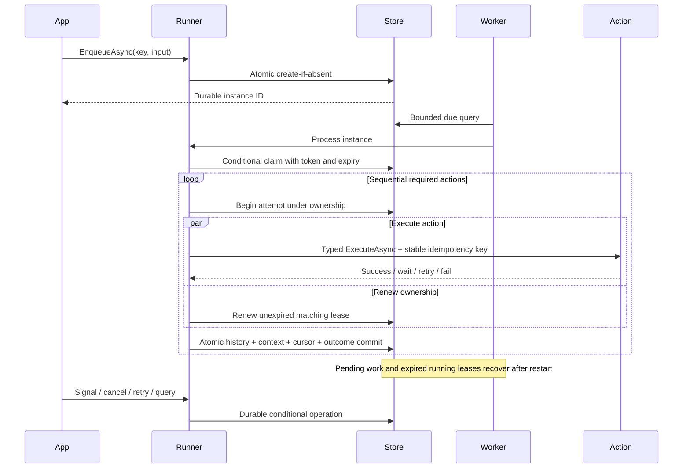

```mermaid
sequenceDiagram
    participant App
    participant Runner
    participant Store
    participant Worker
    participant Action
    App->>Runner: EnqueueAsync(key, input)
    Runner->>Store: Atomic create-if-absent
    Store-->>App: Durable instance ID
    Worker->>Store: Bounded due query
    Worker->>Runner: Process instance
    Runner->>Store: Conditional claim with token and expiry
    loop Sequential required actions
        Runner->>Store: Begin attempt under ownership
        par Execute action
            Runner->>Action: Typed ExecuteAsync + stable idempotency key
            Action-->>Runner: Success / wait / retry / fail
        and Renew ownership
            Runner->>Store: Renew unexpired matching lease
        end
        Runner->>Store: Atomic history + context + cursor + outcome commit
    end
    Note over Worker,Store: Pending work and expired running leases recover after restart
    App->>Runner: Signal / cancel / retry / query
    Runner->>Store: Durable conditional operation
```
